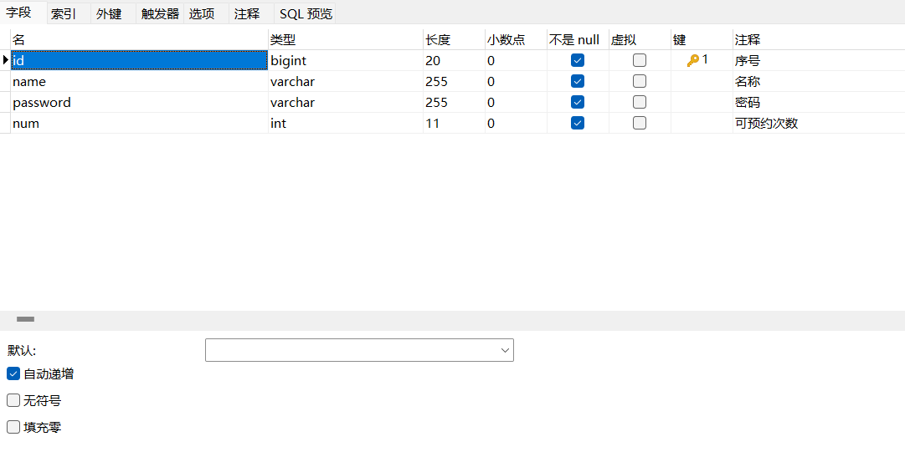
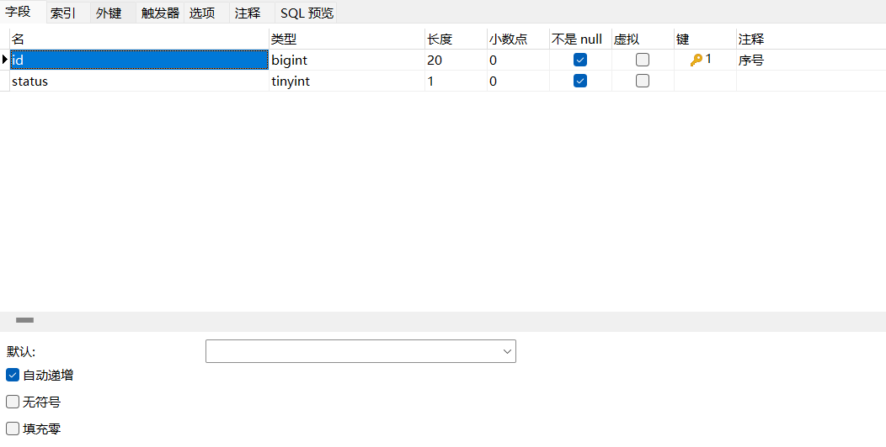
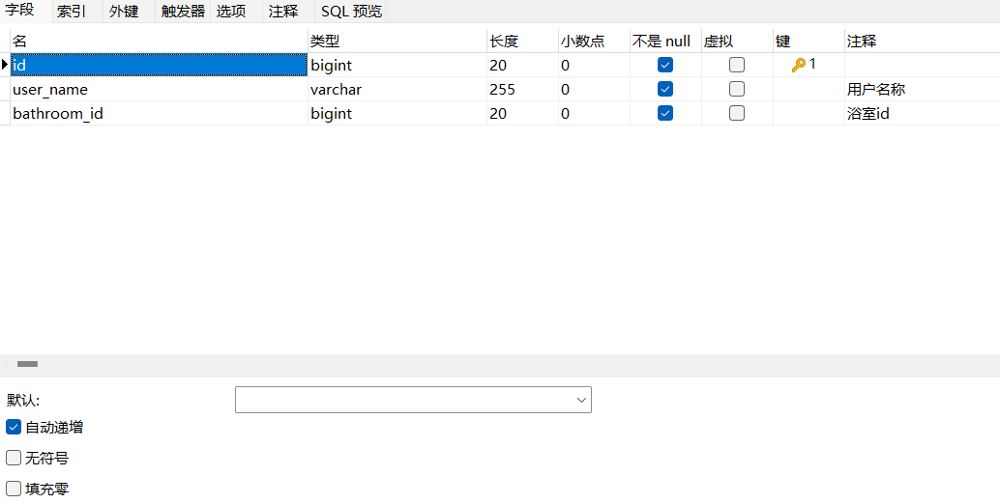
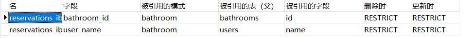

# 小浴室管理系统
##  一、配置
- IDEA 2024.1.4
- TOMCAT 9.0.97
- MYSQL 8.0
- JDK版本：1.8
- 所需一些jar包已在/WEB-INF/lib目录下

## 二、所用技术
- 前端：JSP+JavaScript+CSS
- 后端：Servlet+JDBC+Filter
- MVC架构模式

## 三、项目演示

*http://*

## 四、数据库字段
- users表

- bathrooms表

- reservations表

外键设计：

## 五、项目目前存在缺陷

- 目前有些错误提示尚未完善，异常处理这部分知识欠佳，还需弥补
- 管理员界面尽量不要对浴室进行增删，因数据库设计有缺陷（浴室的id既是主键也设为自增）
- 数据库中管理员的name一定为admin，复用性差
- 数据库的连接未使用连接池，资源利用率较差
- 界面较为单调，未进行美化
- JDBC未用BaseDao，耦合性较高
